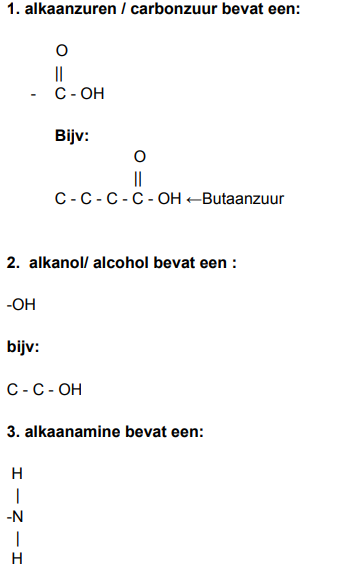

# Scheikunde(Havo 4) H3


Dit hoofdstuk is nog niet afegmaakt kijk voor voldige h3 in de pdf op de scheikunde pagina


## Groepen tabel

<table><thead><tr><th width="167" align="center"></th><th width="149" align="center">Soort deeltjes</th><th width="156" align="center">Binding</th><th align="center">Rooster</th><th align="center">Stroom</th></tr></thead><tbody><tr><td align="center">Metalen groep (geel in binas)</td><td align="center">Metaal atoomen</td><td align="center">Metaal  binding</td><td align="center">Metaal rooster</td><td align="center">Ja</td></tr><tr><td align="center">Moleculaire groep (rood)</td><td align="center">Niet-metaal atoomen</td><td align="center">Atoom binding</td><td align="center">Molecuul rooster</td><td align="center">Nooit</td></tr><tr><td align="center">Zouten (geel/rood)</td><td align="center">Niet metaal en metaal ionen</td><td align="center">ion binding</td><td align="center">ion rooster</td><td align="center">Aleen als het opgelost is</td></tr></tbody></table>

## Covalentie tabel

<table><thead><tr><th width="280" align="center">Groepen in periodiek systeem</th><th width="200" align="center">Covalentie</th></tr></thead><tbody><tr><td align="center">17</td><td align="center">1</td></tr><tr><td align="center">16</td><td align="center">2</td></tr><tr><td align="center">15</td><td align="center">3</td></tr><tr><td align="center">14</td><td align="center">4</td></tr></tbody></table>

## Van der waals verbindingen(krachten)

Moleculen in vloeibaar en vaste fase hebben altijd een zwakke aantrekkingskracht.\
\
Hoe sterker de van der waals kracht hoe meer energie het kost om de stof naar gasfase te krijgen hoe hoger het kookpunt is. hoe groter de Molecuulmassa hoe sterker de van der waals krachten.

## Waterstofbruggen

Moleculen met NH en/of OH groepen kunnen waterstofbruggen vormen(met waterMoleculen) waterstof bruggen ontstaan doordat de atomen niet allemaal even sterk aan het gemeenschappelijk elektronenpaar trekken de lading wordt dan een beetje ongelijk verdeeld dat noemen wij een polaire binding water is een polaire stof vetten zijn apolaire stof(hydrofobische stof) polaire stoffen mengen goed met andere polaire stoffen apolaire stoffen mengen goed met andere apolaire stoffen maar polair en apolaire stoffen mengen niet goed met elkaar

## Stofgroepen tabel

er zijn 3 soorten stof groepen

<table><thead><tr><th width="294" align="center">Stofgroepen</th></tr></thead><tbody><tr><td align="center">Zouten</td></tr><tr><td align="center">Metalen</td></tr><tr><td align="center">Moleculaire</td></tr></tbody></table>

## Stofgroepen eigenschappen

### metalen eigenschappen

<table><thead><tr><th width="286">Metalen</th></tr></thead><tbody><tr><td>Geleid stroom</td></tr><tr><td>glanst</td></tr><tr><td>geleid warmte</td></tr><tr><td>Sterk</td></tr><tr><td>Vervormbaar</td></tr></tbody></table>

### Edele metalen

reageren amper met andere stoffen \
**Bijv:** ze worden niet aangetast door water (goud)

### Non-edel metalen

<table><thead><tr><th width="317">Non-edel metalen</th></tr></thead><tbody><tr><td>reageerd sneller</td></tr><tr><td>oxideren</td></tr><tr><td>reageerbaar met water</td></tr></tbody></table>

### Manieren om metalen te beschermen

<table><thead><tr><th width="324">Manieren</th></tr></thead><tbody><tr><td>verven</td></tr><tr><td>Olie/vet</td></tr><tr><td>laagje glas</td></tr><tr><td>verzinken</td></tr><tr><td>legeringen</td></tr></tbody></table>

***

## Gefractioneerde destillatie van aardolie

<table><thead><tr><th width="110"></th><th width="151">Aardolie</th></tr></thead><tbody><tr><td>C 40</td><td>Petrol</td></tr><tr><td>C 100</td><td>naptha</td></tr><tr><td>C 140</td><td>kerosine</td></tr><tr><td>C 250</td><td>diesel</td></tr><tr><td>C 330</td><td>Olie</td></tr><tr><td>> C 330</td><td>residu(asphalt)</td></tr></tbody></table>

Check figuur 1 boek blz 141 Aardolie bestaat uit koolwaterstoffen op tabel 1. Hoe meer koolstof atomen des te hoger het kookpunt Aardolie heeft een kooktraject. hoe langer de koolstof keten hoe meer van der waals kracht hoe hoger het kookpunt

***

## Verbanding vereist

<table><thead><tr><th width="269">vereisten</th></tr></thead><tbody><tr><td>Brandstof</td></tr><tr><td>Zuurstof </td></tr><tr><td>ontbrandings temperatuur</td></tr></tbody></table>

_**bijv:**_\
$$2\ C_{2}H_{6} + 7\ O_{2} \ -> 4\ CO_{2} \ +\ 6\ H_{2}O$$

***

## verbrandings tabel

<table><thead><tr><th width="187" align="center">In de brandstof</th><th width="227" align="center">Komt uit de verbranding</th></tr></thead><tbody><tr><td align="center">C</td><td align="center">CO_{2}</td></tr><tr><td align="center">H</td><td align="center">H_{2}O</td></tr><tr><td align="center">S</td><td align="center">SO_{2}</td></tr><tr><td align="center">N</td><td align="center">NO_{x}</td></tr></tbody></table>

Stoffen met O = -oxide

***

## Bij producten

#### Fijnstoffen:

kleine vaste deeltjes die vrij komen bij verbranding

#### Smog

Sm[^1]oke, Fog[^2] = smog\
Rook deeltjes die blijven hangen als mist

#### Zwavel

als in de brandstof zwavel zit krijg je bij een verbranding $$SO_{2}$$\
$$SO_{2}$$--> zwavel zuur --> Zure regen\
Brandstof dus eerst ontzwavelen

### Onvoldoende verbranding(te weinig zuurstof)

bij een onvoldoende verbranding heb je te weinig zuurstof daardoor onstaat koolstof en koolstofmonoxide daardoor krijg je gas en roet

***

## termen 1

#### Structuurformule:

een tekening die zichtbaar maakt hoe atoomen gebonden zijn volgends covalentie

#### Koolwater stoffen

C en H'tjes gebonden in een structuurformule&#x20;

#### Alka[^3]an[^4]

geen dubbele binding tussen koolstof atomen&#x20;

#### Alk[_een_](#user-content-fn-5)[^5]

een dubble binding tussen koolstof atomen

_**Bijvoorbeeld:**_

_**Butaan -->**_ $$C_{4}H_{10}$$\
**Buteen -->** $$C_{4}H_{8}$$

## Alkanen en alkenen

H = hoeveelheid koolstof atoomen

<table><thead><tr><th width="197" align="center">H</th><th width="254" align="center">Alkanen</th><th width="263" align="center">Alkenen</th></tr></thead><tbody><tr><td align="center">1</td><td align="center">C_{1}H_{4}</td><td align="center">X</td></tr><tr><td align="center">2</td><td align="center">C_{2}H_{6}</td><td align="center">C_{2}H_{5}</td></tr><tr><td align="center">3</td><td align="center">C_{3}H_{8}</td><td align="center">C_{3}H_{6}</td></tr><tr><td align="center">4</td><td align="center">C_{4}H_{10}</td><td align="center">C_{1}H_{8}</td></tr></tbody></table>

| Systematische naam | Triviale naam |
| :----------------: | :-----------: |
|        C1H4        |    Methaan    |
|        C2H6        |     Ethaan    |
|        C2H4        |     Etheen    |
|        C3H8        |    Propaan    |
|        C3H6        |    Propeen    |

***

**But-1-een:                                       But-2-een:** \
C = C - C - C                            C - C = C -C\
\
Voor benaanming benaming check binas 66D

### Isomeren

dezelfde Molecuulformule maar met een andere structuurformule met een andere naam

***

## 4 karakteristieke (Zij) groepen

<figure><figcaption></figcaption></figure>

[^1]: 

[^2]: 

[^3]: 

[^4]: 

[^5]: 
