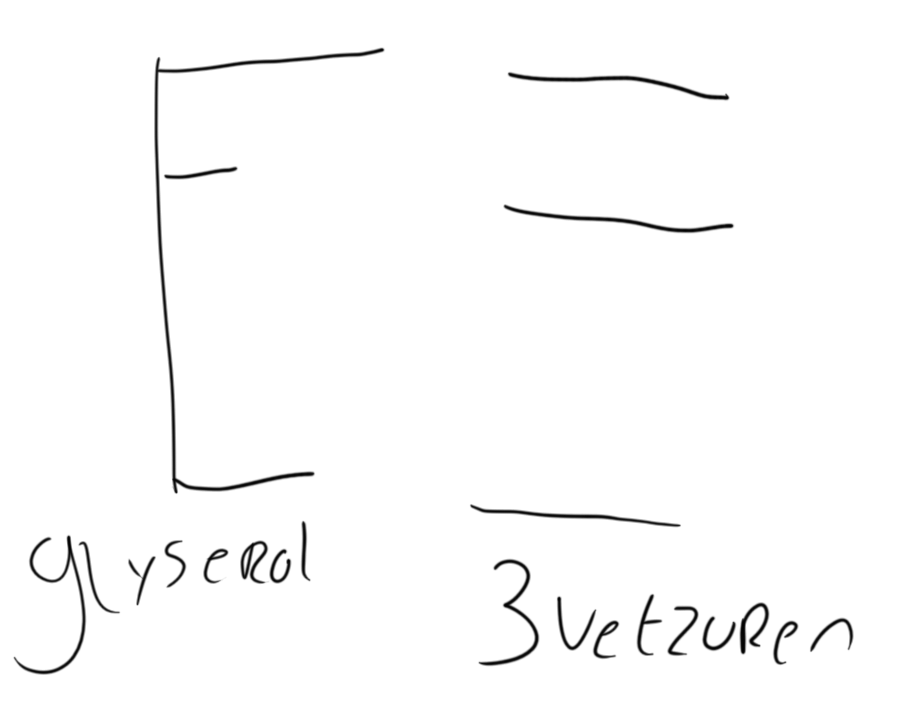
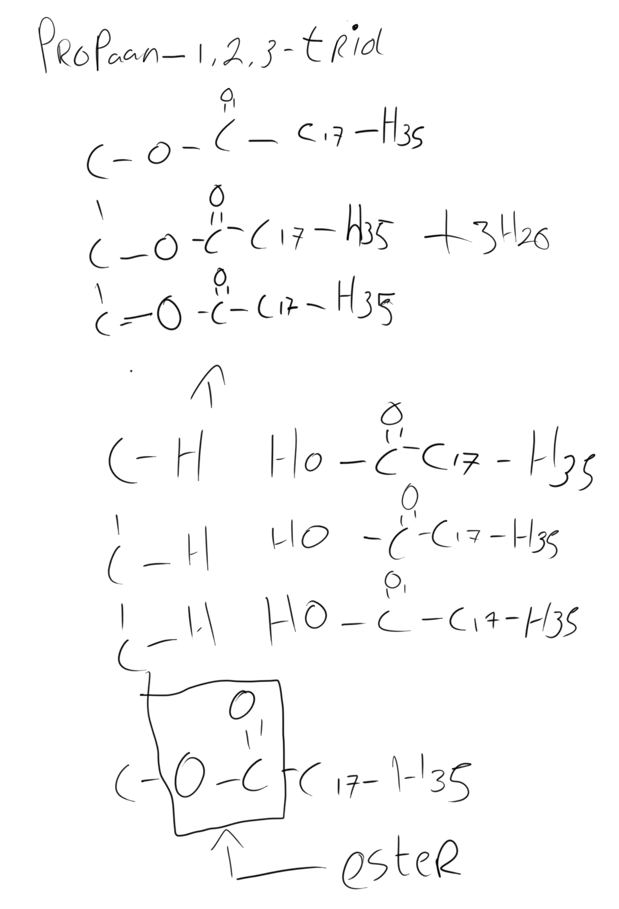
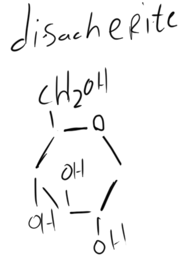
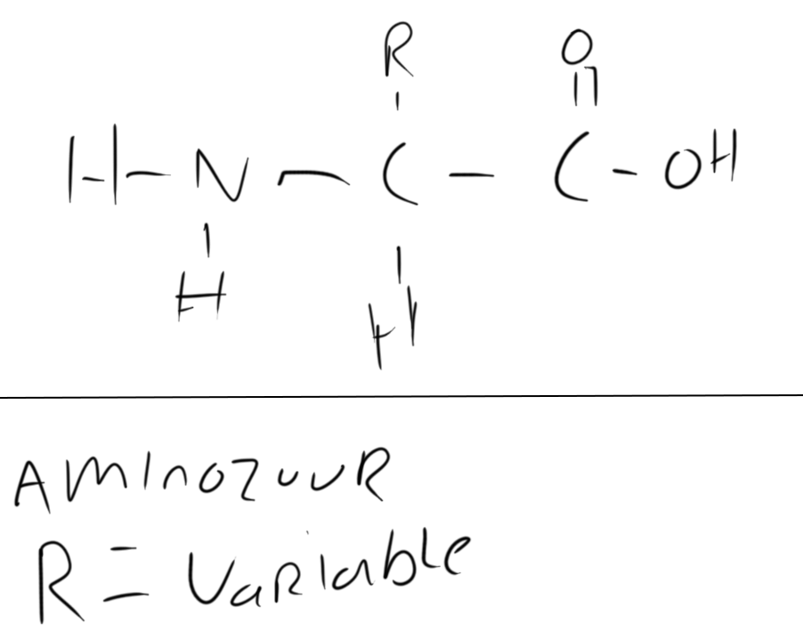
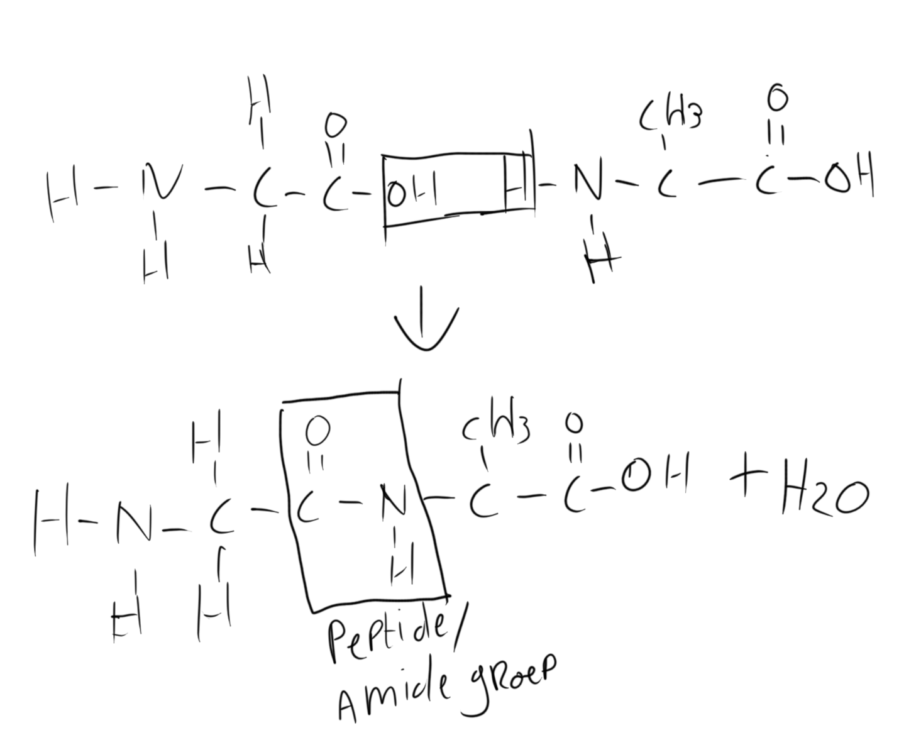

# scheikunde Havo 5 h10

### Voedingstoffen

<table><thead><tr><th width="219" align="center"></th><th width="132" align="center">Bouwstoffen</th><th width="155" align="center">Brandstof</th></tr></thead><tbody><tr><td align="center">Eiwitten</td><td align="center">X</td><td align="center"></td></tr><tr><td align="center">Koolhydraten</td><td align="center"></td><td align="center">X</td></tr><tr><td align="center">Vetten</td><td align="center">X</td><td align="center">X</td></tr><tr><td align="center">vietaminen/ mineralen/ vezels</td><td align="center">X</td><td align="center"></td></tr></tbody></table>

Groodheid: Energie\
Eenheid: joule(j) of calorie(Cal)

### Vetten

<figure><figcaption></figcaption></figure>

<figure><figcaption></figcaption></figure>

### Olie en vetten

<figure><figcaption></figcaption></figure>

#### Vethardings proces

Dit process zorgt er voor dat de onverzadigden vetten verzadigd worden door middel van h2

## Koolhydraten

Polysacherite -> zetmeel -> koolhydraat

Monosacheriete (monomeer)\
Disacherite:

<figure><figcaption></figcaption></figure>


Bindingen in structuur formules bij een -OH groep **MOETEN ALTIJD** naar de O wijzen


## 10.4

<figure><figcaption></figcaption></figure>

<figure><figcaption></figcaption></figure>

