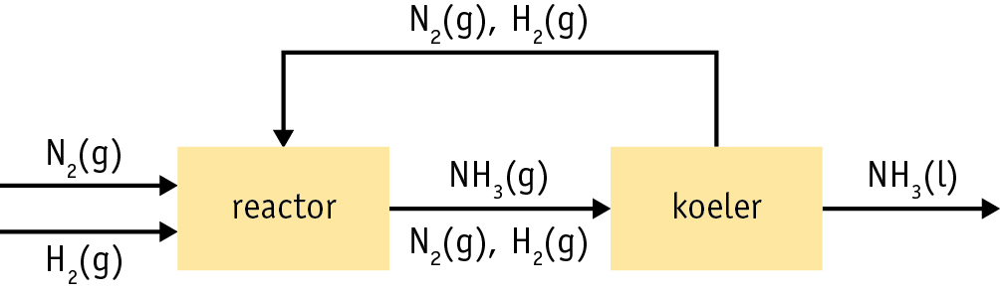

# scheikunde Havo 5 h11

## Blokschema

<figure><figcaption>
Bron: malberg Nova scheikunde
</figcaption></figure>


Blokken betekenen een handeling en een pijl betekent een stof stroom


### 3 belangrijke factoren

1. Temperatuur:\
   &#x20;     energie kosten & mileu
2. Druk\
   &#x20;       druk bestendige vaten nodig & hoger gevaar risco
3. katalysator:\
   &#x20;       versnelt de reactie door de activerings energie te verlagen.\
   &#x20;       Let op! word gebruikt maar niet verbruikt

Binas 38b

## Atoomeconomie

de atoomeconomie is het percentage atoomen van de beginstoffen die in het gewenste product zitten\
dit percentage wil je altijd zo hoog mogelijk hebben\
binas 37H,97F

$$
AE= \frac{massa\ gewenst}{massa\ begin }\cdot{100}\%
$$


AE is atoomeconomie


## recylen

Efficient produceren \
&#x20;               \-Met zo min mogelijk kosten zo veel mogelijk produceren in een korte tijd

Afval -> zo veel mogelijk proberen te verkomen&#x20;

Downwcyclen -> kwaliteits verlies bij herhaalde productie

<table><thead><tr><th width="252" align="center">Afval verwerking nederland</th></tr></thead><tbody><tr><td align="center">Gft</td></tr><tr><td align="center">Pmd</td></tr><tr><td align="center">Papier</td></tr><tr><td align="center">Glas</td></tr></tbody></table>

<table><thead><tr><th width="150" align="center">Pmd</th></tr></thead><tbody><tr><td align="center">Plastic</td></tr><tr><td align="center">Metalen</td></tr><tr><td align="center">Drank flessen</td></tr></tbody></table>

### Kringlopen

elementen kringloop(koolstof kringloop)\
Stoffen kringloop -> stoffen verplaasten\
cradle to cradle (wieg naar wieg)&#x20;

## Binas

<table><thead><tr><th width="100">Tabel</th></tr></thead><tbody><tr><td>38B</td></tr><tr><td>37H</td></tr><tr><td>97F</td></tr></tbody></table>
