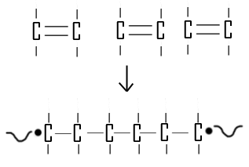
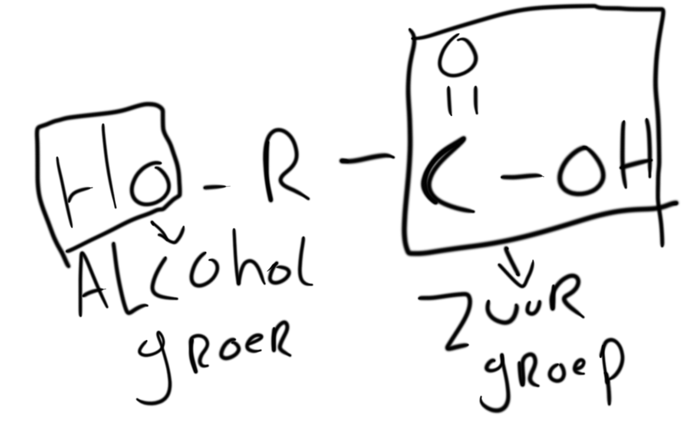
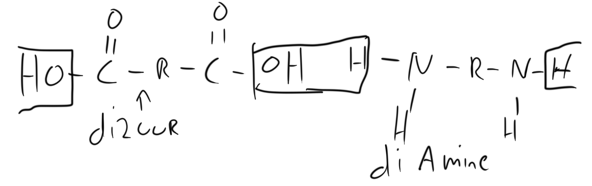
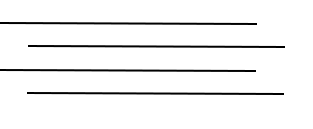
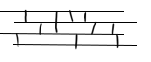

# scheikunde Havo 5 h9

### Geleid vermogen

<table><thead><tr><th width="165">Stof soorten</th><th width="209">Geleidbaare fase</th></tr></thead><tbody><tr><td>Metaal</td><td>Vast + vloeibaar</td></tr><tr><td>Zouten</td><td>Opgelost + vloeibaar</td></tr><tr><td>Molecule stof</td><td>Nooit</td></tr></tbody></table>

### Oplosbaarheid in water op microniveau

De 'Deeltjes' die een -OH en of -NH groepen hebben kunnen met andere deeltjes met een van die twee groepen samen een water stof brug vormen

## Polymeren

Poly- betekend veel

### Polyadditie

<figure><figcaption>
een polymeer
</figcaption></figure>

### Condensatie / hyrdolyse

&#x20;      O\
&#x20;      ||\
R - C - OH            HO - R\
zuurgroep            Alcohol groep\
\
&#x20;      O                                          O\
&#x20;      ||   condensatie   ->           ||\
R - C - OH  + HO - R <-    R - C - O - R + H2O    \
&#x20;                                  hydrolyse

### Polyesters

**2 soorten Polyesters**

Soort 1

<figure><figcaption></figcaption></figure>

Soort 2

<figure><figcaption></figcaption></figure>

### Polyamide

er zijn twee soorten polyamides

Soort 1

<figure><figcaption></figcaption></figure>

soort 2

<figure><figcaption></figcaption></figure>

### Polymeren

Thermoplast  -> kan niet tegen warmte \
Thermoharder -> kunnen wel tegen warmte

| thermo       | macro niveau       |
| ------------ | ------------------ |
| Thermoplast  | Vervormt met hitte |
| Thermoharder | Ontleed bij warmte |

Thermoplast op micro niveau

<figure><figcaption></figcaption></figure>

een thermoplast eenige bindingen zijn van der waals binden of soms waterstof bruggen

Thermoharder op micro niveau

<figure><figcaption></figcaption></figure>

een thermoharder zijn binding zijn veel sterker om dat ze met covelente bindingen tussen de mulecule ketens zitten wat ze dus veel meer beschermt tegen vervorming van hitte en kunnen dus niet over elkaar heen bewegen

### Toevoegingen bij polymeren

* week makers
* VV stablisatoren
* kleurstoffen
* Hoe meer structuren in de polymeer keten hoe hoger de tempratuur voor vervormen
* Je kan aleen thermoplasten rycelen
