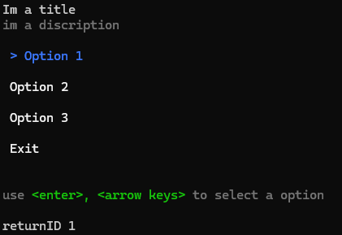
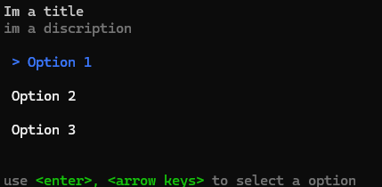

# Selection menu


```csharp
// all selection menu settings
public ConsoleColor unselectedColor = ConsoleColor.White;//when not hovered is this color
public ConsoleColor hoverColor = ConsoleColor.Blue;// when hover over color
public string title = string.Empty; // set selection menutitle
public string description = string.Empty;// sets selection menu discription
public bool HasExit = true; //set if there is a way to exit without a selected option
```

***

```csharp
Config.AddChoise(title,returnid(optional))// adds option title and returnID

// the return id is set to title if not used
// The return id is usefull for getting selected option data out of returnDatatype
```

***

### Example code

```csharp
using CreamsConsole_utils;

selectionMenu.config config = new selectionMenu.config() { };

config.AddChoise("Option 1", "returnID 1"); // add option with title and a return id 
config.AddChoise("Option 2", "returnID 2");
config.AddChoise("Option 3"); // add option with title and a return id = title
config.title = "Im a title";
config.description = "im a discription";


string output = selectionMenu.runtimeMenu(config);
Console.WriteLine(output);
```

#### Output

<figure><figcaption><p>with exit</p></figcaption></figure>

<figure><figcaption><p>without exit</p></figcaption></figure>


